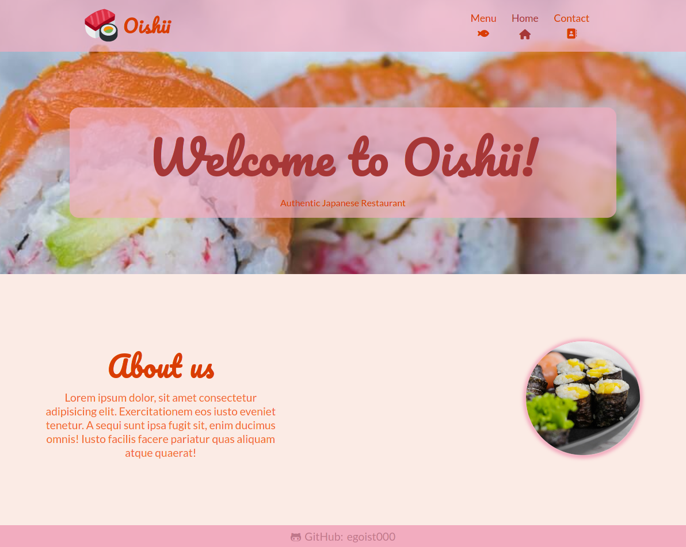
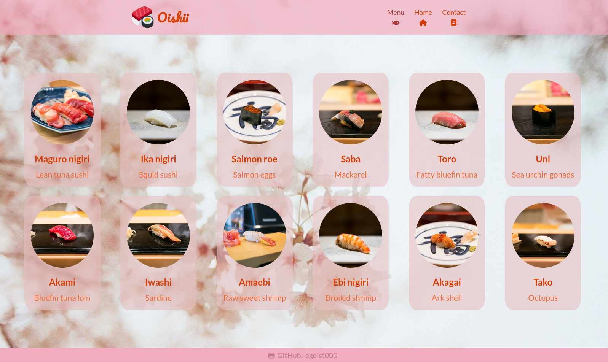
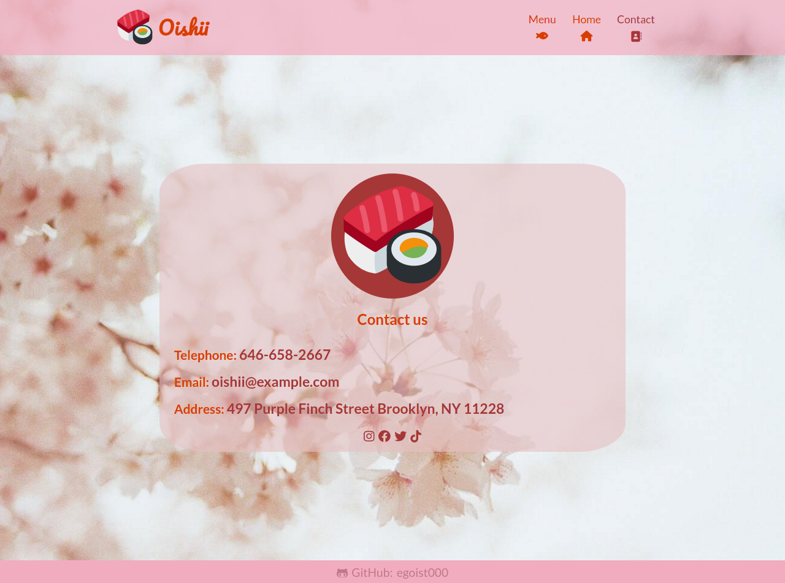

# restaurant-page
A restaurant [page](https://egoist000.github.io/restaurant-page/) using javascript and webpack
## Photo credits
- [chevanon](https://www.pexels.com/@chevanon)
- [rajesh-tp](https://www.pexels.com/@rajesh-tp-749235)
- [valeriya](https://www.pexels.com/@valeriya)
- [emmanuel-zua](https://www.pexels.com/@emmanuel-zua-1349510)
- [sl-wong](https://www.pexels.com/@sl-wong-338694)
- [cityfoodsters](https://www.flickr.com/photos/cityfoodsters/)
- [favicon from twemoji](https://twemoji.twitter.com/)
## Screenshots
# Home

# Menu

# Contact

